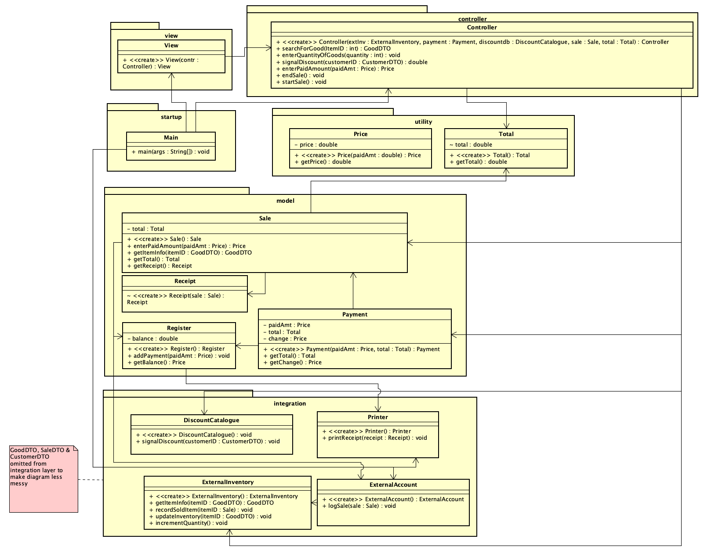
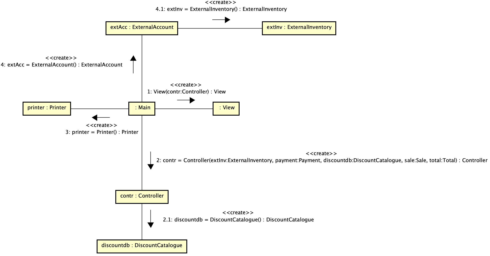
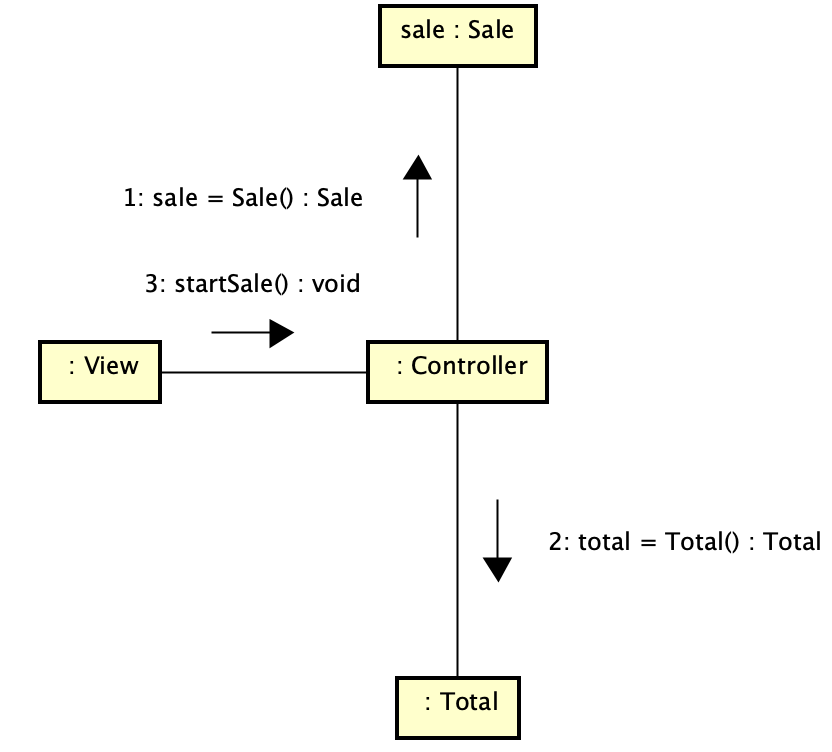
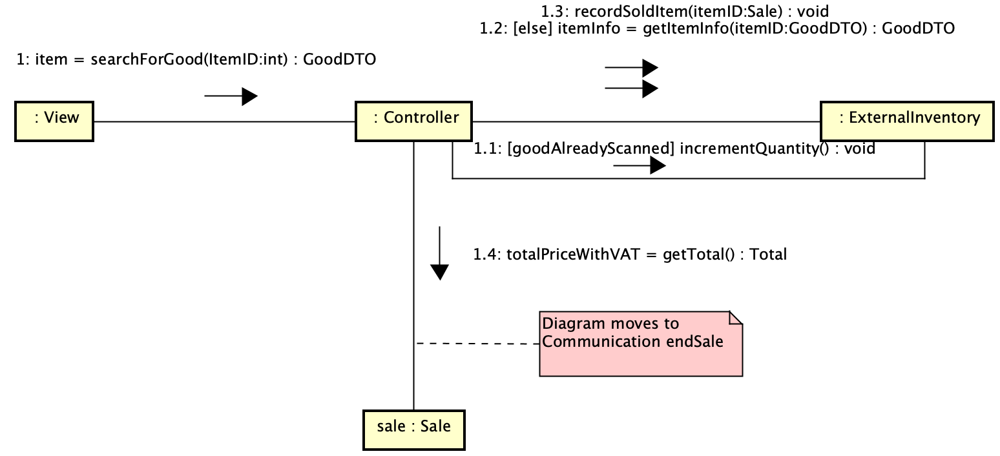
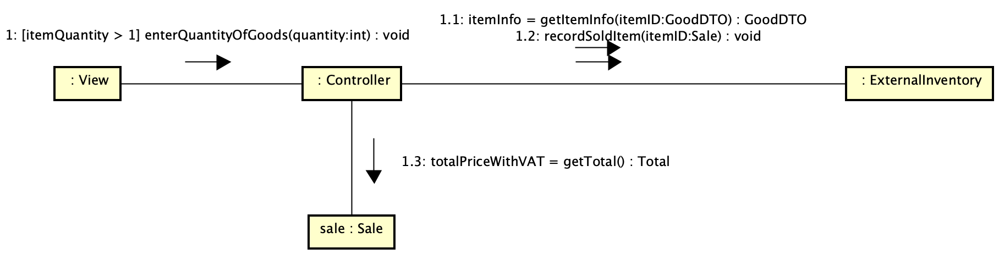
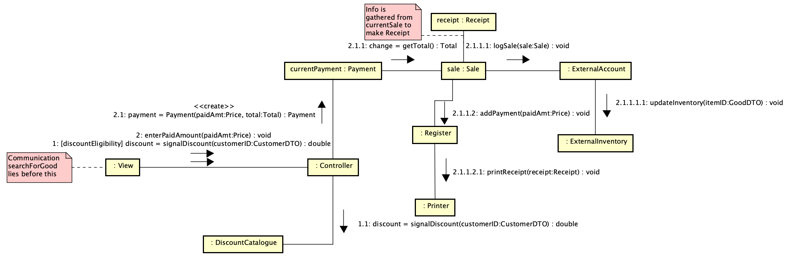
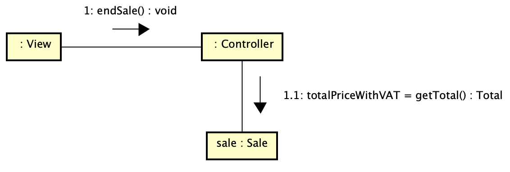

# Process Sale
This is a POS system that simulates a Cashier system (Process Sale), which was created as part of the course IV1350 Object Oriented Design at the Royal Institute of Technology KTH.

## Class Diagram

## Communication diagrams

### Startup

### Start sale

### Search for goods

### Enter quantity of goods

### Pay for goods

### End sale

## Notes
The codebase found in this repo differs somewhat from the design as some changes have been made. All the designs were made in Astah Professional using UML design language.